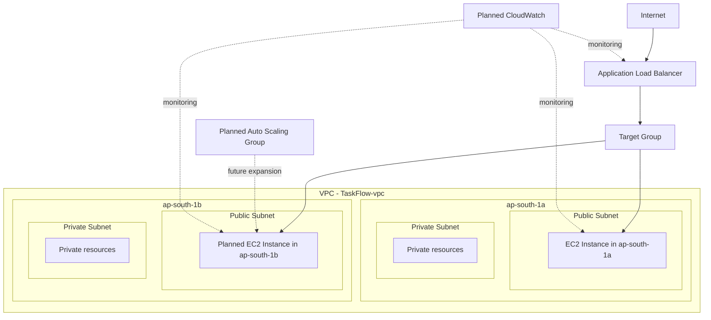

# TaskFlow

<div align="center">


</div>

Simple tasks. Reliable infrastructure.

TaskFlow is a cloud architecture case study and frontend demo for a highly available, multi-tier AWS deployment aligned with the AWS Well-Architected Framework. The project focuses on a polished task management dashboard built with React, Vite, and Tailwind CSS, while also presenting the architecture and resiliency story behind the application.

This repository contains the frontend implementation and the case-study architecture narrative. It does not include a backend, database, authentication flow, or live AWS application deployment logic.

## Table of Contents

- [Project Overview](#project-overview)
- [Problem Statement](#problem-statement)
- [Project Objectives](#project-objectives)
- [Key Features of the TaskFlow Dashboard](#key-features-of-the-taskflow-dashboard)
- [Technology Stack](#technology-stack)
- [Current AWS Architecture](#current-aws-architecture)
- [Architecture Diagram](#architecture-diagram)
- [Current AWS Infrastructure](#current-aws-infrastructure)
- [Security Architecture](#security-architecture)
- [High Availability Strategy](#high-availability-strategy)
- [AWS Well-Architected Framework](#aws-well-architected-framework)
- [Current Implementation Status](#current-implementation-status)
- [Planned Improvements / Roadmap](#planned-improvements--roadmap)
- [Project Structure](#project-structure)
- [Local Development Setup](#local-development-setup)
- [Build and Deployment Instructions](#build-and-deployment-instructions)
- [AWS Deployment Overview](#aws-deployment-overview)
- [Screenshots](#screenshots)
- [Learning Outcomes](#learning-outcomes)
- [Future Enhancements](#future-enhancements)
- [Author](#author)
- [Project Status](#project-status)

## Project Overview

TaskFlow is a frontend dashboard designed to demonstrate a practical cloud-native application concept for a college case study in cloud computing. The app presents a modern task management interface while communicating the larger AWS deployment strategy behind it.

The project is intentionally centered on the frontend experience and architecture explanation, rather than attempting to implement a real backend, database, or application API. This keeps the scope realistic for a front-end case study while still demonstrating how AWS networking, availability, and resiliency concepts apply to a production-style application.

## Problem Statement

Many cloud architecture projects focus on infrastructure diagrams without showing how a real application experience looks in practice. TaskFlow addresses this by combining:

- a modern task dashboard interface,
- a realistic cloud deployment narrative,
- a clear explanation of availability and resiliency concepts,
- and a structured AWS Well-Architected discussion.

This allows the project to serve as both a UI demo and a cloud architecture teaching artifact.

## Project Objectives

- Build a polished, professional task management dashboard.
- Showcase a cloud-native SaaS-style design inspired by AWS architecture patterns.
- Demonstrate task management behavior using local frontend state and browser storage.
- Explain the architecture in a way that aligns with AWS best practices.
- Separate clearly between currently implemented features and future AWS improvements.
- Keep the repository lightweight and suitable for demo purposes.

## Key Features of the TaskFlow Dashboard

The current frontend implementation includes:

- Dark SaaS-style dashboard layout
- Responsive sidebar navigation
- Search and filtering for tasks
- Task creation modal
- Task completion toggle
- Task deletion flow
- Dynamic task statistics
- Local persistence with `localStorage`
- Architecture modal and infrastructure explanation panel
- AWS Well-Architected framework section
- Toast notifications for user feedback
- Responsive layout for desktop, tablet, and mobile

## Technology Stack

The project currently uses the following actual technologies present in the repository:

| Category | Technology | Status |
| --- | --- | --- |
| Frontend framework | React | Implemented |
| Build tooling | Vite | Implemented |
| Styling | Tailwind CSS | Implemented |
| Icons | Lucide React | Implemented |
| Language | JavaScript / JSX | Implemented |
| Browser storage | localStorage | Implemented |

### Actual dependencies from package.json

- `react`: 19.2.8
- `react-dom`: 19.2.8
- `vite`: 8.2.2
- `tailwindcss`: 4.3.3
- `@tailwindcss/vite`: 4.3.3
- `lucide-react`: 1.43.0
- `eslint` and React linting setup for development quality checks

> This project does not implement a backend, database, or authentication system.

## Current AWS Architecture

### Implemented / Current State

The repository is a frontend application and architecture demo. The following AWS architecture elements are part of the current project context and case-study description:

- Amazon VPC named `TaskFlow-vpc`
- VPC CIDR: `10.0.0.0/16`
- Two Availability Zones:
  - `ap-south-1a`
  - `ap-south-1b`
- Four subnets:
  - Public subnet 1 in `ap-south-1a`
  - Private subnet 1 in `ap-south-1a`
  - Public subnet 2 in `ap-south-1b`
  - Private subnet 2 in `ap-south-1b`
- Internet Gateway
- Public/private route table separation
- Security groups:
  - `TaskFlow-ALB-SG`
  - `TaskFlow-EC2-SG`
- EC2 instance: `TaskFlow-EC2-1`
- Amazon Linux 2023
- Nginx installed and serving the frontend application
- Target Group: `TaskFlow-TG`
- Application Load Balancer with HTTP listener on port 80

### Planned AWS Architecture

The following elements are planned for the next stages of the case study and are not represented as currently implemented in this repository:

- Second EC2 instance in a second Availability Zone
- Auto Scaling Group
- Launch Template
- Expanded multi-AZ deployment topology
- CloudWatch monitoring and alarms
- IAM role and permission hardening
- Additional AWS services where appropriate
- More advanced resilience and optimization patterns

## Architecture Diagram



> The second EC2 instance, Auto Scaling, and CloudWatch are clearly marked as planned future components in this diagram, not currently implemented in the repository.

## Current AWS Infrastructure

| Component | Details | Status |
| --- | --- | --- |
| VPC | `TaskFlow-vpc` with CIDR `10.0.0.0/16` | ✅ Current |
| Availability Zones | `ap-south-1a`, `ap-south-1b` | ✅ Current |
| Public Subnets | One in each AZ | ✅ Current |
| Private Subnets | One in each AZ | ✅ Current |
| Internet Gateway | Internet ingress for public networking | ✅ Current |
| Security Groups | ALB and EC2 groups | ✅ Current |
| EC2 Instance | `TaskFlow-EC2-1` on Amazon Linux 2023 | ✅ Current |
| Nginx | Serving the React frontend | ✅ Current |
| Target Group | `TaskFlow-TG` | ✅ Current |
| ALB | HTTP port 80 forwarding to target group | ✅ Current |
| Second EC2 Instance | Planned in second AZ | 🔜 Planned |
| Auto Scaling Group | Planned | 🔜 Planned |
| CloudWatch | Planned monitoring and alarms | 🔜 Planned |

## Security Architecture

The current project emphasizes a security-focused design narrative aligned with AWS best practices:

- Security groups are used to segment traffic between load balancer and application hosts.
- Public and private subnet separation supports least-privilege networking.
- EC2 hosts are treated as application tier resources in a controlled networking layout.
- The frontend repository itself does not include a backend or API layer, so there is no application authentication or database security layer to implement in this demo.

### Security posture in the current scope

- ✅ Network isolation using separate public/private subnets
- ✅ Security group control for application access
- ✅ ALB-managed request routing
- 🔜 IAM hardening, managed identity, and more advanced cloud security controls (planned)

## High Availability Strategy

### Currently Implemented

The architecture described in the case study is structured around a basic highly available pattern:

- Internet traffic enters through an Application Load Balancer.
- The ALB forwards requests to a target group.
- The app is served through an EC2 instance running Nginx.
- The design concept supports future expansion into a multi-instance, multi-AZ deployment.

### Planned

The next stage is to add:

- a second EC2 instance in another Availability Zone,
- automatic traffic distribution,
- a launch template,
- and an Auto Scaling Group for resilience and demand-based scaling.

This is the current high-availability roadmap and is intentionally marked as future work rather than claiming it is already deployed.

## AWS Well-Architected Framework

The application and its architecture are framed around the six pillars of the AWS Well-Architected Framework.

### 1. Operational Excellence

**Current context:** The project demonstrates a cloud architecture case study and monitoring-focused operational narrative. The frontend also includes monitoring-oriented UI messaging and architecture explanation panels.

**Implementation emphasis:** Observability, health review, and structured deployment practices.

### 2. Security

**Current context:** The design includes subnet isolation and security-group separation.

**Implementation emphasis:** Network segmentation, least-privilege access, and controlled exposure to the internet.

### 3. Reliability

**Current context:** The architecture seeks to avoid single points of failure by planning multi-AZ distribution.

**Implementation emphasis:** Redundancy, load balancing, and future multi-instance application availability.

### 4. Performance Efficiency

**Current context:** The architecture demonstrates a simple, scalable web application serving model with traffic distribution through an ALB.

**Implementation emphasis:** Efficient network routing and horizontal scaling for future growth.

### 5. Cost Optimization

**Current context:** The case study aims to balance availability with efficient infrastructure sizing.

**Implementation emphasis:** Planned Auto Scaling and demand-based scaling help avoid unnecessary compute consumption.

### 6. Sustainability

**Current context:** The architecture encourages efficient use of resources and avoids over-provisioning where possible.

**Implementation emphasis:** Elastic scaling and improved utilization over the long term.

## Current Implementation Status

This repository currently includes:

- ✅ Frontend dashboard built in React + Vite
- ✅ Task manager interactions and local persistence
- ✅ Modern dark dashboard design
- ✅ AWS architecture explanation UI
- ✅ Case-study presentation aligned to AWS cloud concepts
- ✅ Responsive, professional demo experience

This repository does not include:

- ❌ Real backend service
- ❌ Database layer
- ❌ Authentication system
- ❌ Live AWS integration logic
- ❌ Real EC2 auto-scaling configuration code in this project

## Planned Improvements / Roadmap

1. Add the second EC2 instance in the second Availability Zone.
2. Implement or document the Auto Scaling Group and Launch Template.
3. Add CloudWatch monitoring for health, metrics, and alarms.
4. Improve the architecture narrative with infrastructure-as-code examples.
5. Expand the demo to better illustrate production-grade resilience patterns.
6. Add richer Cloud architecture case-study documentation for deployment and operations.

## Project Structure

```text
cloudapp/
├── .gitignore
├── dist/
├── dist.zip
├── eslint.config.js
├── index.html
├── node_modules/
├── package-lock.json
├── package.json
├── public/
├── README.md
├── src/
│   ├── App.jsx
│   ├── components/
│   │   ├── architecture/
│   │   │   ├── ArchitectureDiagram.jsx
│   │   │   └── ArchitectureModal.jsx
│   │   ├── dashboard/
│   │   │   ├── CloudStatus.jsx
│   │   │   ├── StatCard.jsx
│   │   │   ├── TaskCard.jsx
│   │   │   ├── TaskList.jsx
│   │   │   └── WelcomeSection.jsx
│   │   ├── layout/
│   │   │   ├── Header.jsx
│   │   │   └── Sidebar.jsx
│   │   ├── tasks/
│   │   │   ├── AddTaskModal.jsx
│   │   │   └── DeleteTaskModal.jsx
│   │   ├── ui/
│   │   │   └── Toast.jsx
│   │   └── wellArchitected/
│   │       └── WellArchitected.jsx
│   ├── data/
│   │   └── initialTasks.js
│   ├── index.css
│   ├── main.jsx
│   └── assets/
├── vite.config.js
└── package.json
```

## Local Development Setup

### Prerequisites

- Node.js and npm installed
- A modern browser

### Install dependencies

```bash
npm install
```

### Start the app in development mode

```bash
npm run dev
```

### Build for production

```bash
npm run build
```

### Preview production build

```bash
npm run preview
```

## Build and Deployment Instructions

### Frontend build

The project uses Vite for bundling and production output generation.

```bash
npm run build
```

This generates the production build output in the `dist/` directory.

### Deployment note

The current repository demonstrates the frontend and cloud architecture case study. It is not a production backend deployment package. For cloud deployment, the frontend can later be hosted via AWS static hosting patterns or a web-serving EC2 strategy as part of the architecture roadmap.

## AWS Deployment Overview

The current design intent follows this deployment flow:

```text
Internet
   ↓
Application Load Balancer
   ↓
Target Group
   ↓
EC2 instance(s)
   ↓
Nginx
   ↓
React Frontend
```

### Current deployment narrative

- Client requests flow through the public internet.
- ALB distributes traffic to the target group.
- EC2 hosts serve the frontend.
- Future expansion will include multiple EC2 instances across AZs and Auto Scaling support.

## Screenshots

> Screenshots will be added here as the project evolves and visual captures of the dashboard are recorded.

### Placeholder gallery

- Dashboard overview
- Task management section
- AWS architecture modal
- Well-Architected cards
- Mobile responsive layout

## Learning Outcomes

This project helps demonstrate:

- modern frontend application architecture,
- AWS cloud design thinking,
- high availability and resilience concepts,
- networking design fundamentals,
- and application presentation in a real-world architecture context.

## Future Enhancements

- Add a second EC2 instance in another Availability Zone.
- Add Auto Scaling and Launch Template documentation.
- Integrate CloudWatch monitoring examples.
- Expand the architecture section into a deeper AWS deployment narrative.
- Add static deployment guidance for hosting the frontend on AWS.

## Author

This project was developed as a cloud architecture and frontend demonstration focused on the AWS Well-Architected Framework and modern dashboard design.

## Project Status

- Phase 1 — Frontend: Completed
- Phase 2 — VPC & Networking: Completed
- Phase 3 — EC2 + Nginx Deployment: Completed
- Phase 4 — Application Load Balancer: Completed
- Phase 5 — Multi-AZ EC2 Deployment: Planned
- Phase 6 — Auto Scaling: Planned
- Phase 7 — Monitoring & Optimization: Planned

---

## Summary

TaskFlow is a professional frontend dashboard and AWS case-study demo that demonstrates how a modern cloud-native application can be explained through both user-facing design and infrastructure architecture. It is intentionally focused on the frontend experience and the cloud design story, while clearly separating current implementation from planned AWS expansion.

- [@vitejs/plugin-react](https://github.com/vitejs/vite-plugin-react/blob/main/packages/plugin-react) uses [Oxc](https://oxc.rs)
- [@vitejs/plugin-react-swc](https://github.com/vitejs/vite-plugin-react/blob/main/packages/plugin-react-swc) uses [SWC](https://swc.rs/)

## React Compiler

The React Compiler is not enabled on this template because of its impact on dev & build performances. To add it, see [this documentation](https://react.dev/learn/react-compiler/installation).

## Expanding the ESLint configuration

If you are developing a production application, we recommend using TypeScript with type-aware lint rules enabled. Check out the [TS template](https://github.com/vitejs/vite/tree/main/packages/create-vite/template-react-ts) for information on how to integrate TypeScript and [`typescript-eslint`](https://typescript-eslint.io) in your project.
